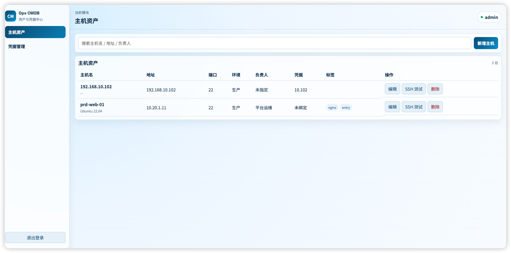

# Vue3 + Golang CMDB（Gin + GORM + MySQL + Redis）

这是一个运维 CMDB 示例项目：

- 前端：Vue3 + Vite + Pinia
- 后端：Golang + Gin + GORM + MySQL + Redis
- 配置：`viper` + `app.toml`
- 日志：`lumberjack` + `zap` + `zapcore`
- 功能：登录校验、主机资产管理、凭据管理（账号密码 / SSH 私钥）、SSH 连接测试

## 后端 MVC 目录

```text
server/
  app.toml                            # 配置文件
  cmd/api/main.go                     # 程序入口
  internal/
    config/                           # viper 配置加载
    global/                           # 全局对象（DB/REDIS/LOGGER/CONFIG）
    logger/                           # zap + lumberjack 初始化
    models/                           # GORM 模型层
    services/                         # 业务服务层（使用 global.DB/global.REDIS）
    controllers/                      # 控制器层
    middleware/                       # 认证/CORS/请求日志
    router/                           # 路由注册
    bootstrap/                        # MySQL/Redis 初始化、迁移、seed
    utils/                            # 工具（加密、token、tags）
```

## 配置文件（app.toml）

后端默认读取 `server/app.toml`。

```toml
[app]
name = "cmdb-server"
port = "8080"
mode = "release"

[mysql]
host = "127.0.0.1"
port = 3306
username = "root"
password = "root"
db = "cmdb"
charset = "utf8mb4"
parse_time = true
loc = "Local"
max_idle_conns = 10
max_open_conns = 50
conn_max_lifetime_minutes = 60

[redis]
addr = "127.0.0.1:6379"
password = ""
db = 0

[auth]
secret = "change-me-to-a-strong-secret-key"
session_ttl_hours = 12

[log]
level = "info"
filename = "logs/app.log"
max_size = 20
max_backups = 10
max_age = 30
compress = true
console = true
```

也支持环境变量覆盖（示例）：

- `CMDB_APP_PORT=8081`
- `CMDB_MYSQL_HOST=127.0.0.1`
- `CMDB_MYSQL_PORT=3306`
- `CMDB_MYSQL_USERNAME=root`
- `CMDB_MYSQL_PASSWORD=root`
- `CMDB_MYSQL_DB=cmdb`
- `CMDB_REDIS_ADDR=...`
- `CMDB_AUTH_SECRET=...`

## 启动后端

先确保 MySQL 和 Redis 可用，再执行：

```bash
cd server
go mod tidy
go run ./cmd/api
```

默认登录账号：

- 用户名：`admin`
- 密码：`Admin@123456`

## 启动前端

```bash
npm install
npm run dev
```

前端会通过 Vite 代理将 `/api` 转发到 `http://127.0.0.1:8080`。

## 构建前端

```bash
npm run build
npm run preview
```

## 页面图片
